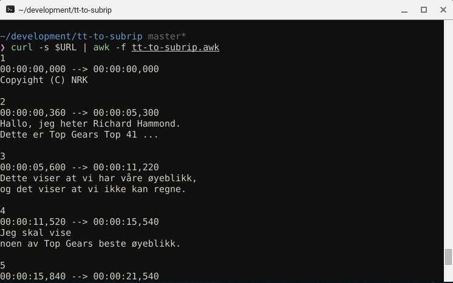

# TimedText to SubRip
> Simple tt to srt converter, in awk.



## Overview

I saw that the local boardcasting company supplied tt subtitles with ther internet TV. I wanted to get it in SubRip format, to make it work on all my devices. 
 
## Install

```sh
$ git clone https://github.com/odinuge/tt-to-subrip/
```


## Usage

Simply just use it like any other awk file.

```sh
$ curl -s $URL | awk -f tt-to-subrip.awk > sub.srt
```

If the subtitle contains several languages, you have to pass a filename.
```sh
$ curl -s $URL | awk -v filename=sub.srt -f tt-to-subrip.awk
```


## FAQ

### Fuction X is not working.

Feel free to [fix(fork) it!](https://github.com/odinuge/tt-to-subrip/fork) 


## License

MIT © [Odin Ugedal](https://ugedal.com)
